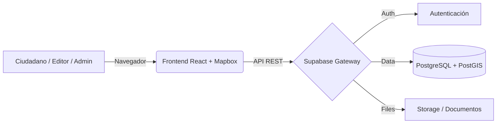

# Bitácora PMDU Cancún 🏝️

Plataforma digital interactiva para la consulta, participación y seguimiento del Plan Municipal de Desarrollo Urbano (PMDU) de Cancún. Este proyecto permite a la ciudadanía visualizar mapas, consultar documentos oficiales y participar activamente en el proceso de planeación urbana.

## 🛠 Stack Tecnológico

Este proyecto utiliza una arquitectura moderna y desacoplada (**Headless**), separando la interfaz de usuario de la gestión de datos.

### Frontend (SPA)
El cliente web está construido con las últimas versiones del ecosistema React:
* **Core:** [React 19](https://react.dev/) + [TypeScript](https://www.typescriptlang.org/)
* **Build Tool:** [Vite](https://vitejs.dev/)
* **Enrutamiento:** [React Router v7](https://reactrouter.com/)
* **Mapas & GIS:** * [Mapbox GL JS v3](https://docs.mapbox.com/mapbox-gl-js/) + Mapbox Geocoder
* **Estilos:** CSS Modules (Estilos encapsulados por componente) + CSS nativo
* **Iconos:** React Icons

### Backend & Infraestructura (Próximamente)
La gestión de contenidos y datos será **Self-Hosted** para garantizar la soberanía de la información:
* **BaaS / CMS:** [Supabase](https://supabase.com/) (Open Source)
* **Base de Datos:** PostgreSQL + PostGIS (para datos geográficos)
* **Despliegue Backend:** Docker & Docker Compose (On-Premise)

---

## 🏗 Arquitectura del Sistema

El sistema sigue una arquitectura híbrida donde el Frontend consume datos de una API generada automáticamente por Supabase.



## 📋 Requisitos Previos

Para ejecutar este proyecto localmente necesitas:
* **Node.js** (v18 o superior)
* **Docker Desktop** (para levantar la base de datos localmente)
* Una cuenta y token de **Mapbox**

## 🔧 Instalación y Configuración

1.  **Clonar el repositorio:**
    ```bash
    git clone [https://github.com/melnotte/bitacora-pmdu-cancun.git](https://github.com/melnotte/bitacora-pmdu-cancun.git)
    cd bitacora-pmdu-cancun
    ```

2.  **Instalar dependencias:**
    ```bash
    npm install
    ```

3.  **Configurar Variables de Entorno:**
    Crea un archivo `.env` en la raíz del proyecto basado en el siguiente ejemplo:

    ```env
    # .env
    # Token necesario para renderizar los mapas
    VITE_MAPBOX_TOKEN=pk.tu_token_publico_de_mapbox_aqui
    
    # URL de conexión al Backend (Supabase Local por defecto)
    VITE_SUPABASE_URL=[http://127.0.0.1:54321](http://127.0.0.1:54321)
    VITE_SUPABASE_ANON_KEY=tu_clave_anonima_local
    ```

4.  **Levantar el Servidor de Desarrollo:**
    ```bash
    npm run dev
    ```
    La aplicación estará disponible en `http://localhost:5173`.

---

## 🐳 Levantar Backend Local

Para desarrollar funcionalidades que requieran base de datos (Login, Guardar comentarios, CMS), utilizaremos Docker.

1.  Asegúrate de tener Docker corriendo.
2.  Inicializa los servicios:
    ```bash
    npx supabase start
    ```
3.  Al finalizar, obtendrás las credenciales `API URL` y `anon key` que debes colocar en tu archivo `.env`.

---

## 📂 Estructura del Proyecto

```text
src/
├── assets/          # Imágenes y recursos estáticos
├── components/      # Componentes reutilizables (Botones, Cards, etc.)
│   ├── layout/      # Navbar, Footer, Layout principal
│   ├── home/        # Componentes específicos del Home
│   └── ...
├── data/            # Datos estáticos (JSONs provisionales)
├── lib/             # Configuración de clientes (Supabase, Utils)
├── pages/           # Vistas principales (Rutas)
│   ├── Maps.tsx     # Visor de Mapbox
│   └── ...
├── App.tsx          # Configuración de Rutas (React Router)
└── main.tsx         # Punto de entrada
```

## 📦 Scripts Disponibles

* `npm run dev`: Inicia el servidor de desarrollo.
* `npm run build`: Compila la aplicación para producción (TypeScript + Vite).
* `npm run lint`: Ejecuta ESLint para buscar errores de código.
* `npm run preview`: Vista previa local del build de producción.

---
**Desarrollado para el Instituto de Planeación de Desarrollo Urbano (IMPLAN) Municipio de Benito Juárez.**
