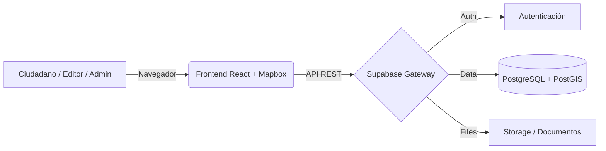

# Bitácora PMDU Cancún 🏝️

Plataforma digital interactiva para la consulta, participación y seguimiento del Plan Municipal de Desarrollo Urbano (PMDU) de Cancún. Este proyecto permite a la ciudadanía visualizar mapas, consultar documentos oficiales y participar activamente en el proceso de planeación urbana.

## 🛠 Stack Tecnológico

Este proyecto utiliza una arquitectura moderna y desacoplada (**Headless**), separando la interfaz de usuario de la gestión de datos.

### Frontend (SPA)
El cliente web está construido con las últimas versiones del ecosistema React:
* **Core:** [React 19](https://react.dev/) + [TypeScript](https://www.typescriptlang.org/)
* **Build Tool:** [Vite](https://vitejs.dev/)
* **Enrutamiento:** [React Router v7](https://reactrouter.com/)
* **Mapas & GIS:** * [Mapbox GL JS v3](https://docs.mapbox.com/mapbox-gl-js/) + Mapbox Geocoder
* **Estilos:** CSS Modules (Estilos encapsulados por componente) + CSS nativo
* **Iconos:** React Icons

### Backend & Infraestructura (Próximamente)
La gestión de contenidos y datos es soportada por:
* **BaaS / CMS:** [Supabase](https://supabase.com/) (Open Source)
* **Base de Datos:** PostgreSQL + PostGIS (para datos geográficos)
* **Despliegue Backend:** Docker & Docker Compose (On-Premise)

---

## 🏗 Arquitectura del Sistema

El sistema sigue una arquitectura híbrida donde el Frontend consume datos de una API generada automáticamente por Supabase.


```mermaid
graph LR
    A[Ciudadano / Editor / Admin] -->|Navegador| B(Frontend React + Mapbox)
    B -->|API REST| C{Supabase Gateway}
    C -->|Auth| D[Autenticación]
    C -->|Data| E[(PostgreSQL + PostGIS)]
    C -->|Files| F[Storage / Documentos]
```

## 📋 Requisitos Previos

Para ejecutar este proyecto localmente necesitas:
* **Node.js** (v18 o superior)
* **Docker Desktop** (para levantar la base de datos localmente)
* Una cuenta y token de **Mapbox**

## 🔧 Instalación y Configuración

1.  **Clonar el repositorio:**
    ```bash
    git clone [https://github.com/melnotte/bitacora-pmdu-cancun.git](https://github.com/melnotte/bitacora-pmdu-cancun.git)
    cd bitacora-pmdu-cancun
    ```

2.  **Instalar dependencias:**
    ```bash
    npm install
    ```

3.  **Configurar Variables de Entorno:**
    Crea un archivo .env basado en el ejemplo para conectar tu cliente de Supabase y Mapbox:

    ```bash
    cp .env.example .env
    ```

    Configura las siguientes llaves con tus credenciales de proyecto: 

    * **VITE_SUPABASE_URL:** URL de tu proyecto en Supabase. 
    * **VITE_SUPABASE_ANON_KEY:** Tu llave pública anónima. 
    * **VITE_MAPBOX_TOKEN:** Tu token de Mapbox para los mapas.

4. **Configurar Base de Datos y Almacenamiento:**

    Este proyecto requiere que tu instancia de Supabase tenga el esquema de tablas y datos iniciales. Los archivos necesarios se encuentran en la carpeta /supabase. 
 
    Sigue los pasos detallados aquí: 👉 [Guía detallada de configuración de Supabase](./supabase/README.md)

5.  **Levantar el Servidor de Desarrollo:**
    ```bash
    npm run dev
    ```
    La aplicación estará disponible en `http://localhost:5173`.

---

## 🐳 Levantar Backend Local

Si utilizas el CLI de Supabase para desarrollo local: 
1. Asegúrate de tener Docker corriendo. 
2. Inicializa los servicios: 
    ```bash 
    npx supabase start
    ```
3. Al finalizar, obtendrás las credenciales `API URL` y `anon key` que debes colocar en tu archivo `.env`.
4. El sistema aplicará automáticamente las migraciones y el seed de datos. 

--- 
## 📂 Estructura del Proyecto

```text 
src/ 
├── components/ # Componentes de UI (layout, home, maps, etc.) 
├── hooks/ # Lógica de mapas e interacciones 
├── lib/ # Cliente de Supabase inicializado 
├── pages/ # Vistas principales (Home, Maps, Consultation, etc.) 
└── types/ # Tipos de TypeScript y Esquema de Supabase 
supabase/ 
├── migrations/ # Esquema SQL remoto para clonar las tablas 
├── seed.sql # Datos de prueba (Encuestas, comentarios, etc.) 
└── README.md # Guía paso a paso para desplegar en tu servidor Supabase 
```

## 📦 Scripts Disponibles

* `npm run dev`: Inicia el servidor de desarrollo.
* `npm run build`: Compila la aplicación para producción (TypeScript + Vite).
* `npm run lint`: Ejecuta ESLint para buscar errores de código.
* `npm run preview`: Vista previa local del build de producción.

---
**Desarrollado para el Instituto de Planeación de Desarrollo Urbano (IMPLAN) Municipio de Benito Juárez.**